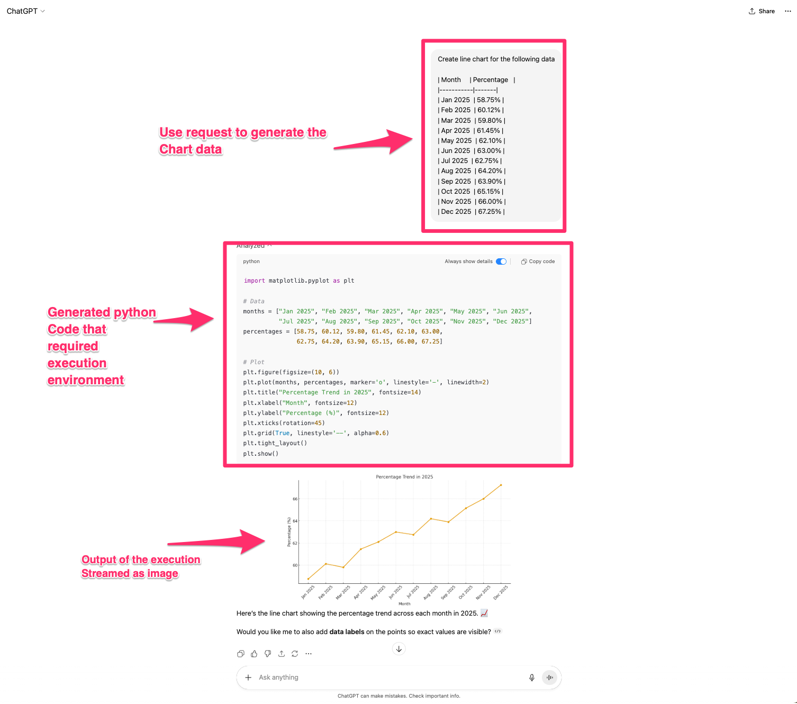
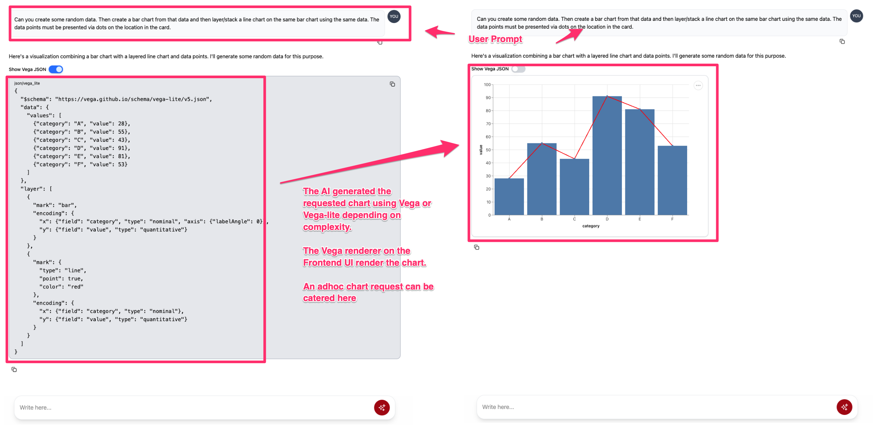

# A Technical Overview For Implementation Of GenAI Data Visualizations


The GenAI-powered data analysis has reached impressive capabilities, but **translating insights into visual formats within GenAI applications** remains a significant technical challenge. Current industry approaches using "ephemeral applications" - where AI generates and executes code in sandboxed environments - create unstable user experiences with frequent execution failures and substantial implementation complexity for custom GenAI applications.

This article examines three approaches to AI-generated data visualization:

1. The current ephemeral application model.
1. A frontend component integration
1. A standards-based solution using Vega JSON specifications 

While ephemeral applications offer flexibility, they sacrifice reliability and user experience. Frontend component approaches improve stability but create tight coupling between systems and technical debt. This article **converges on leveraging Vega JSON**, a mature open-source visualization specification that AI models, due to extensive training data availability, as well as traditional software, due to the original specification design, can generate, comprehend and handle reliably. This Open-source standards-based approach **decouples frontend and backend systems** while maintaining stability, enables seamless chat history preservation, and provides cross-platform portability without requiring complex execution environments.

The key benefits of such an approach includes: 

- Dramatically improved reliability for non-technical users
- Reduced architecture and infrastructure complexity
- Optimized GenAI context window and token costs.
- Better maintainability through coupling to open standards
- Ability to create sophisticated visualizations without custom development. 
- Flexibility to leverage the same data across channels (web apps, mobile apps, desktop apps, and data visualization apps)

Organizations implementing GenAI-driven analytics should consider this approach to achieve production-grade stability while maintaining the flexibility that makes GenAI-generated visualizations valuable for business intelligence applications.

## The GenAI Data Visualization Challenge

The GenAI models and agentic systems are fundamentally transforming how organizations can extract insights from data. The Large Language Models (LLMs) can use various kinds of tools to query databases, perform complex analysis, and articulate findings with remarkable sophistication. Yet **a critical gap persists** at the intersection of AI capability and user experience i.e. **effectively presenting data-driven insights through visual representations within these largely text based interfaces**.

### Dynamic Visualization Requirements vs. Static Development Paradigms

The technical complexity emerges when attempting to bridge AI-generated insights with frontend application requirements. Unlike traditional business intelligence tools where visualizations follow predictable patterns that can be coded with confidence, GenAI-driven applications must dynamically generate visual charts in real-time based on conversational context, varying data structures from multiple sources, and evolving user queries. This fundamental mismatch between static development paradigms and dynamic AI requirements creates architectural friction that existing approaches struggle to resolve efficiently.

Current implementations by major providers and the broader GenAI community attempt to address these expectations through increasingly sophisticated approaches, yet they frequently suffer from instability and execution failures. These poor visualization experiences directly erode user trust in AI systems, particularly among non-technical stakeholders who interpret chart generation failures as fundamental AI limitations rather than implementation challenges.


## The Core Problem: AI Can't Simply Execute What It Creates

The fundamental friction in AI-generated data visualization stems from a core architectural mismatch i.e. **User Interface (UI) technologies**, including data visualization tools, are predominantly built around an **imperative programming paradigm**, meaning that generating UI dynamically requires executable code on the UI platform. Whether it's JavaScript for web applications, SwiftUI for iOS, or platform-specific graphics libraries elsewhere, the process demands that code be written, then executed in the correct environment to transform data into rendered graphics.

While GenAI systems excel at generating the necessary code, that code cannot be executed directly within application UI due to:

1. Technical compatibility constraints that arise because UI platforms operate within specific programming language ecosystems and runtime environments. For example, a web browser expecting JavaScript cannot directly execute Python Matplotlib code. (This partilcular example may be somewhat solve by Web Assembly which would be quite an interesting proposition)

1. More fundamentally, security restrictions do not allow such kind of operations. Cross-site scripting (XSS) protections, which are essential OWASP security standards, explicitly prevent the execution of dynamically generated code within client applications.

The result is an execution gap where AI systems can generate sophisticated visualization code but cannot bridge the final step of rendering that code within the user's interface, forcing current solutions to rely on complex workarounds that compromise either security, reliability, or user experience.

## A Production-grade GenAI data visualization approach

This technical landscape demands a systematic evaluation of available approaches, their trade-offs, and emerging solutions that enable enterprise applications to deliver:

- The flexibility GenAI enables
- Production-grade stability
- Long-term maintainability and evolvability

### Approach 1: Ephemeral Applications - The Current Industry Standard

Major GenAI providers, like OpenAI and Anthropic, have established the current industry standard through what has become known as the "ephemeral application" approach. This model treats data visualization as a general code execution problem, where AI systems generate programming code on-demand and execute it within sandboxed environments to produce visual outputs.

#### Technical Overview

The providers navigate the AI code execution problem by leveraging cloud-based execution environments like CodeSandbox and Replit that execute the dynamically generated code and return rendered visualizations as images or interactive components back to the chat interface. ChatGPT exemplifies this approach most visibly, where users can request data visualizations and observe the AI generating Python code, executing it in a sandboxed environment, and displaying the resulting charts directly within the conversation thread. Demonstrated in the image below.



This is a logical evolution from pre-GenAI solutions where developers needed remote code execution environment to facilitate collaboration. The same infrastructure that enabled collaborative coding environments now powers AI-generated visualizations, creating a familiar technical foundation for major providers to build upon.


#### Strategic Advantages for General-Purpose Platforms

The ephemeral application approach delivers significant strategic advantages for platforms serving diverse user bases such as ChatGPT and Claude. \

1. The generality of code execution enables users to request virtually any type of visualization or even complete applications, limited only by the AI's programming capabilities and available libraries. This flexibility aligns perfectly with the positioning of general-purpose AI assistants that must handle unpredictable user requests across unlimited domains.

1. This approach minimizes the need for specialized tooling or predefined visualization types. A single execution environment can theoretically handle everything from simple bar charts to complex interactive dashboards and even basic web applications. 

This architectural decision reduces platform complexity while maximizing perceived GenAI capabilities.

#### Enterprise Implementation Challenges

Despite its strategic benefits for general-purpose platforms, the ephemeral application model introduces substantial challenges for enterprise implementations. The most significant technological **issues are complexity, reliability, and maintainability**.

Even when leveraging existing code execution SaaS products, development teams must architect, secure, deploy, and maintain sophisticated execution environments. This infrastructure requires container orchestration, security sandboxing, resource management, and cleanup processes, each introducing potential failure points and ongoing operational overhead that scales with user adoption. The reason this all needs to be done basically boils down to the fact that LLMs can generate any code at any point in time with slight variations in the original input prompt.

> Most enterprise use cases are not so open-ended, significantly reducing the value proposition of such generalized UI systems. Enterprise environments typically have well-defined requirements focused on specific needs. Sucd needs usually prioritize consistent UI types, standardized reporting formats, and predictable visualization patterns over unlimited creative flexibility. **This focused scope creates an opportunity for more stable, specialized approaches that can deliver superior reliability and maintainability for enterprise requirements** without sacrificing the core benefits that make GenAI-generated visualizations valuable for business intelligence applications.

##### Agentic AI Bottleneck

The above challenges are significantly amplified in emerging agentic AI architectures where multiple specialized agents collaborate to accomplish tasks. This multi-agent paradigm introduces exponential complexity as the system must coordinate not only AI-to-execution-environment workflows, but also AI-to-AI communication and distributed state management across concurrent visualization tasks. Each agent may generate different code implementations, require different execution contexts, or depend on outputs from other agents, creating a web of dependencies that becomes increasingly difficult to manage and debug. 

Current patterns address this complexity by constraining visualization rendering to a single designated agent at the end of the workflow, but this architectural limitation undermines the collaborative advantages that make agentic systems valuable.

##### The Unpredictability Challenge

The open-ended nature of code generation creates inherent unpredictability that compounds these challenges. AI models frequently generate vastly different code implementations for identical requests, making it nearly impossible to optimize execution environments for consistent performance. Additionally, models must know, via either context engineering or training, about the execution environment constraints, available library versions, and coding standards which cause tight coupling between the execution environment and the LLM which is extremely hard to maintain.

##### Additional UX Challenges

Beyond the technical implementation challenges, the ephemeral application approach creates several user experience friction points that impact adoption and workflow efficiency.

1.  **Static Output Format Constraints:** The rendered visualizations are typically delivered as static images, which creates significant limitations for iterative analysis workflows. When users copy these visualizations to new conversations or share them across different contexts, the AI loses access to the underlying data structure and visualization logic. This pushes users to restart their analysis from scratch rather than building upon previous work.

1. **Reduced Follow-up Query Reliability:** The complexity of maintaining execution context across conversation turns significantly impacts the GenAI's ability to handle follow-up questions effectively. Simple requests like "generate key insights from the data" might result in incorrect output as the GenAI might not be able to collect the insights across the generated code and compile them coherently. Without sophisticated engineering, the GenAI loses the analytical thread when visualization generation is separated from the underlying data analysis, making it difficult to provide accurate contextual responses about the visualized information.

### Approach 2: Frontend Component Integration - Native UI with Structured Data

Organizations facing the inherent complexity and instability of ephemeral code execution might want to solve the reliability issue of ephmeral application by integrating data visualizations directly into their frontend architectures. This approach reframes visualization generation as a structured data exchange problem rather than a general code execution challenge. 

The methodology represents a logical evolution of established software engineering practices, as the majority of modern data dashboards already implement UI components that source data via REST APIs from backend systems. This component-based architecture has been the industry standard for data visualization applications for over a decade, providing a proven foundation for reliability and maintainability.

#### Technical Overview

This methodology establishes a component-based architecture using predefined UI elements (React, SwiftUI, Vue, etc.) with standardized data interfaces. The chat frontend functions as a modular collection of UI components, including chat bubbles, data visualization charts, and supporting elements. The system implements a plugin architecture where component types serve as keys mapped to their corresponding frontend components.

The chat response structure builds upon existing ChatGPT API, where the final response is a structured object collections. The responses consist of content blocks, each containing a type identifier and associated content. This block-based approach extends naturally to data visualization by introducing additional content block types that correspond to available frontend UI components. During response rendering, the UI iterates through each response block and dynamically renders the appropriate component based on the content type specification. This creates a flexible system where complex, multi-modal responses can seamlessly integrate text, visualizations, and interactive elements within a single chat interface.

The architecture's reliability depends on maintaining a critical interface between the GenAI system and the frontend components. It must understand the available UI components and their respective data requirements. This component awareness can be implemented through tool definitions in the GenAI API calls or embedded within system prompts, depending on the application's context engineering practices. This ensures that generated responses always match the frontend's rendering capabilities, creating reliable user experience.

The following demonstrates a GenAI response structure that might result by implementing this architecture:

```json
{
    "messages": {
        "role": "assistant",
        "content": [
            {
                "type": "text",
                "content": "Here is the sales performance analysis:"
            },
            {
                "type": "line_chart",           // There is a UI component on the frontend which corresponds to this type
                "content": {
                    "data": [
                        {"month": "Jan", "revenue": 120000},
                        {"month": "Feb", "revenue": 135000},
                        {"month": "Mar", "revenue": 142000}
                    ],
                    "x_axis_data_key": "month"
                }
            }
        ]
    }
}
```

This approach provides deterministic rendering behavior while maintaining the flexibility for AI-driven data analysis and presentation.

#### Key Benefits of Component-Based Architecture

This architectural approach can provide substantial improvements in user experience and system reliability compared to ephemeral applications approach.

1. The use of native frontend visualization components ensures **robust quality assurance** through established testing frameworks. These components benefit from the same rigorous testing procedures applied to all application elements, maintaining predictable performance characteristics and reducing the likelihood of unexpected failures during critical user interactions.

1. By eliminating remote code execution for visualizations, the system removes an entire class of potential security vulnerabilities and runtime failures. This architectural decision significantly improves system stability while ensuring that all visualizations maintain perfect alignment with the application's established design system.

#### Critical Limitations

1. **Technical Debt and System Complexity:** Despite improved stability, this approach introduces significant architectural challenges that compound over time. The most fundamental issue is tight coupling between backend AI systems and frontend implementations. Both systems must maintain synchronized understanding of data contracts for each supported visualization type, creating dependencies that constrain independent development and deployment. This coupling becomes particularly problematic during system updates, as changes to visualization components require coordinated modifications across multiple system boundaries, increasing the risk of breaking changes and deployment complications.

1. **AI Context Degradation in Follow-up Interactions:** This approach significantly exacerbates the follow-up problem explored in the ephemeral applications approach. Unlike ephemeral applications where AI can interpret its own generated code to understand data context, the structured data approach creates an opaque barrier between the AI and the actual visualization logic. When users ask follow-up questions about displayed charts, the AI must reconstruct the analytical context solely from the structured data payload in its context window, without access to the rendering logic or visual representation. This can be solved by providing AI with details on the UI component in the context window which will cost a siginificant number of tokens (raising GenAI costs) and further UI-Backend coupling.


1. **Agentic AI Coordination Overhead:** While JSON-based data structures do improve inter-agent communication compared to ephemeral applications, this approach still requires complex distributed state management to ensure proper content block ordering and data consistency across multiple agents.


1. **Scalability and Maintenance Burden:** The component-based approach creates an escalating maintenance burden as the application grows. Each new chart type requires synchronized development across AI prompt engineering (reducing the useful context window size), backend data processing, and frontend component implementation. Version compatibility becomes increasingly complex as the system must support historical conversations with older data contracts while implementing new visualization capabilities. This versioning challenge will force teams to maintain multiple parallel implementations or implement complex migration strategies that add significant operational overhead.

### Approach 3: GenAI & Vega – An Open-Source Grammar for Data Visualization

The Frontend Integration approach represents meaningful progress by improving reliability and security. By narrowing the scope to structured data visualization rather than general code execution, it eliminates the risks and overhead associated with remote execution environments. This shift reduces operational complexity and mitigates critical runtime vulnerabilities.

However, these advantages come with trade-offs. The approach introduces tight coupling between backend AI systems and frontend components, creating significant maintenance and evolution challenges. Each new visualization type requires coordinated changes across multiple layers, leading to growing technical debt. In addition, this approach consumes valuable LLM context window space and drives up token costs, making it less scalable and cost-efficient as applications grow.


#### Introducing Vega

[Vega](https://vega.github.io/vega/) and its lighter token-efficent variant, [Vega-Lite](https://vega.github.io/vega-lite/), offer a compelling alternative through a declarative JSON-based grammar for data visualization. Originally developed by the University of Washington’s Interactive Data Lab in the late 2010s, Vega provides a specification for defining statistical data visualizations that can be rendered consistently across platforms and environments.

This specification serves as a robust abstraction layer between LLMs and visualization UIs because:

- **Expressive Specification:** Vega is highly expressive, capable of defining both standard and advanced custom visualizations. This flexibility makes it suitable for a wide range of enterprise use cases.

- **Declarative Approach:** Vega is not a programming language and does not directly render graphics. Instead, it defines specifications that are executed by Vega-compliant renderers. The same Vega spec can therefore be rendered across any platform or language with an available renderer. Mature implementations already exist for the web (JavaScript, WebGL) and Python (via Altair), among others.

- **LLM-Native:** Thanks to its JSON structure, decade-long maturity, and extensive documentation, most modern LLMs have been trained extensively on Vega. They can natively generate, interpret, and refine Vega specifications without additional fine-tuning or context engineering.

- **Production-Grade Reliability:** With stable and mature rendering libraries, enterprises can achieve predictable and reproducible visualization outcomes. Once a Vega renderer is implemented, it works across any LLM and any data visualization requirement, minimizing fragility and integration overhead. Moreover, teams can implement their own vega renders if they want.

- **Future-Proof Flexibility –** Vega’s extensible grammar supports both simple and highly sophisticated visualizations. Its predictable semantic versioning ensures that organizations can evolve visualization capabilities efficiently while minimizing technical debt.

- **Software-Native Compatibility –** Beyond being LLM-native, Vega is inherently software-native. Deterministic code in any programming language can generate valid Vega specifications, ensuring seamless integration into traditional software pipelines as well as GenAI workflows.

- **Extensive tooling and Documentation –** With over a decade of maturity, Vega offers comprehensive documentation that makes it easy to learn, adopt, and troubleshoot. In addition, the Vega ecosystem includes robust online editors and playgrounds that allow developers to experiment with specifications, validate their structure, and quickly debug or refine visualizations. Moreover, current GenAI chatbots (such as ChatGPT) are very well trained on Vega meaning they can help extensively in debugging issues

In essence, Vega JSON combines the flexibility of AI-driven visualization with the stability of open standards, enabling organizations to build scalable, maintainable, and production-ready solutions.

> Currently, [Vega](https://github.com/vega/vega/blob/main/LICENSE) and [Vega-Lite](https://github.com/vega/vega-lite/blob/main/LICENSE) are released under the BSD 3-Clause License, which permits unrestricted use of the specification for commercial and non-commercial purposes alike. There appears to be no indication that the team plans to change this licensing in the near future.

#### Technical Overview

Implementing Vega in a GenAI application is straightforward when the target UI platform has an [official](https://github.com/orgs/vega/repositories) Vega renderer available. If no official or community-supported renderer exists, teams may need to build a custom implementation—an effort-intensive task. Fortunately, mature Vega renderers are already widely available for web and Python platforms, making web-based and JavaScript-based GenAI visualization solutions relatively easy to deploy.

A key advantage of Vega JSON is that it is simply a **self-contained JSON block**. This block can be embedded directly into a markdown string, which LLMs can generate either on their own or via a data tool. By tagging the code block with a specific identifier (e.g., json/vega_lite), the visualization becomes a natural part of the response string. Unlike the Frontend Integration approach, this eliminates the need for specialized content blocks, reducing system coupling and complexity.

On the frontend, the markdown response is typically rendered using a plugin-based Markdown renderer. These renderers allow developers to customize how code blocks are displayed. By detecting the Vega-specific tag, the system can route that block to a Vega renderer while leaving other content unaffected. This design ensures seamless integration of text and charts within the same conversational flow.

For example, a GenAI response embedding a Vega-Lite specification might look like this:

```markdown
Here is a Vega-Lite specification for a line chart visualizing your percentages data by month:

\```json/vega_lite    // Vega-Lite tag added via system prompt
{
  "$schema": "https://vega.github.io/schema/vega-lite/v5.json",
  "description": "Monthly percentage (Jan-Jun)",
  "width": 600,
  "height": 400,
  "data": {
    "values": [
      {"Month": "January", "percentage": 58.75},
      {"Month": "February", "percentage": 60.20},
      {"Month": "March", "percentage": 61.10},
      {"Month": "April", "percentage": 59.80},
      {"Month": "May", "percentage": 62.45},
      {"Month": "June", "percentage": 63.00}
    ]
  },
  "mark": {
    "type": "line",
    "point": true,
    "tooltip": true
  },
  "encoding": {
    "x": {
      "field": "Month",
      "type": "ordinal",
      "title": "Month",
      "sort": ["January", "February", "March", "April", "May", "June"]
    },
    "y": {
      "field": "percentage",
      "type": "quantitative",
      "title": "percentage (%)",
      "scale": {"domain": [58, 64]}
    }
  }
}
\```

This chart displays the monthly percentage data from January to June:

| Month    | Percentage (%) |
|----------|---------|
| January  | 58.75   |
| February | 60.20   |
| March    | 61.10   |
| April    | 59.80   |
| May      | 62.45   |
| June     | 63.00   |
```

> Extremely large datasets (e.g., over one million data points) may require additional optimization. Vega is not always the best fit for such scenarios, as rendering very large visualizations can be inherently challenging given current technology constraints. In these cases, teams should consider leveraging [Vega data sources](https://vega.github.io/vega/docs/data/) (e.g., JSON files, CSVs, or external databases) and techniques such as data aggregation, sampling, or pre-processing to ensure performance and usability.

#### Key Benefits of the Vega Standards-Based Approach

The Vega JSON approach represents a significant advancement in GenAI-powered data visualization by leveraging mature open standards rather than custom implementations. This standards-based methodology delivers substantial advantages across technical, operational, and strategic dimensions.

- **Architectural Simplicity with Maximum Expressiveness:** The elegance of this approach lies in its fundamental simplicity coupled with remarkable expressive power. It does not require complex systems engineering, security requirements or heavy context engineering. Both traditional software and modern LLMs can natively generate, interpret, and handle Vega specifications, reducing overhead while preserving flexibility.

- **AI-Native Understanding:** Because LLMs have been trained on Vega documentation, they can not only generate valid specifications but also reason about them. To end-users, a chart is just a visualization; to the LLM, it is structured textual data. This native understanding enables AI systems to provide detailed insights about visualizations, answer follow-up questions with high accuracy, and iteratively refine charts based on user feedback. The AI perceives Vega specifications as structured textual data rather than complex code or opaque image, allowing for sophisticated reasoning about visual elements, data relationships, and analytical insights without requiring additional context engineering or specialized training.

- **LLM Token and Cost optimization:** Since this is an LLM-native approach, minimal prompt or context engineering is required for the model to interpret or generate reliable Vega specifications. As a result, more of the LLM’s context window can be dedicated to actual analysis and reasoning rather than boilerplate schema or visualization context. This efficiency significantly reduces token consumption, which in turn lowers costs — especially in agentic AI systems where multiple agents interact and exchange context.

- **Agentic AI Alignment:** Vega specifications exist as text strings within the LLM’s response, making them universally interpretable across agents. This simplifies state management in multi-agent systems and ensures consistent handoffs between AI components. Moreover, since the specification can be natively generated by traditional software further optimizations can be achieved by tools which output the Vega spec. This makes the whole Agentic eco-system more vibrant.

- **Reduced Implementation Complexity and Technical Debt:** The Vega ecosystem is already signifiantly mature and production-ready. Markdown renderers and Vega renderers are widely available and tested at scale. This maturity translates to predictable behavior, comprehensive documentation, and robust error handling. The loose coupling between frontend rendering and backend AI systems creates high cohesion within each component while maintaining clean separation of concerns, resulting in systems that are both maintainable and evolvable without accumulating technical debt.

- **Future-Proof Evolution and Backward Compatibility:** Thanks to Vega’s expressive grammar and semantic versioning process, the system can evolve in a controlled and predictable manner, aligned with standard software development lifecycles (SDLC). Its backward-compatible nature ensures older visualizations remain usable and render correctly even as new features are introduced, preserving continuity across historical conversations.

- **Enhanced User Experience and Collaboration:** Vega specifications are lightweight, textual, and natively understood by LLMs, making them inherently portable. Visualizations can be copied into new chats without losing context, shared seamlessly with colleagues (as JSON or rendered images), and even imported into established tools like Altair for further refinement. This portability ensures that insights flow easily across teams and platforms, reducing friction in collaboration while extending the value of each visualization beyond the initial interaction.

- **Improved reliability:** No system is completely immune to errors, but the Vega approach provides clear and well-defined error boundaries. Failures can be attributed either to the LLM generating an invalid specification (chatbot-side error) or to the frontend Vega renderer (UI-side error). This separation makes it easier to diagnose issues, implement graceful error-handling mechanisms, and deploy robust mitigation strategies — resulting in a more predictable and trustworthy user experience.

#### Critical Limitations of Vega

While the Vega approach offers significant advantages, it is not a silver bullet and comes with important trade-offs:

- **Scope Limited to Data Visualization:** Vega and Vega-Lite are highly expressive for charts, graphs, and statistical visualizations, but they are strictly scoped to data visualization. They cannot be used to generate arbitrary UI elements such as web forms, navigation menus, or interactive application components.

- **Renderer Availability:** Official renderers exist for web and Python environments, making implementation straightforward in those contexts. However, platforms such as iOS and Android may require custom renderer development, which introduces additional engineering effort and complexity.

- **Customization Constraints:** Although the Vega specification supports extensive customization of charts (legends, tooltips, shapes, etc.), official renderers are not fully theme-aware. This means visualizations may not always perfectly match the look and feel of an application’s native design system. Fine-grained control over typography, spacing, colors, and interactive behaviors may require workarounds or compromise on design consistency.

- **Learning Curve:** Since Vega uses a domain-specific JSON specification, debugging complex visualizations may require knowledge and understanding of the Vega grammar. While modern AI systems like ChatGPT are highly capable at debugging Vega specifications, teams may still encounter scenarios requiring manual intervention. More significantly, if teams need to implement a Vega renderer from scratch, they must invest substantial time learning and understanding the specification before making meaningful progress.

- **Performance Constraints:** Vega natively does not provide optimizations for rendering extremely large datasets (e.g., more than 100,000 data points), which can cause significant browser strain and require bespoke solutions. While Vega performs excellently for reasonably large datasets, organizations dealing with massive data visualizations may need preprocessing strategies. Additionally, Vega is designed for static data snapshots rather than streaming updates, making it unsuitable for real-time applications like live stock graphs or continuous monitoring dashboards.

Despite these limitations, the Vega approach remains optimal for the majority of GenAI enterprise data visualization use cases, particularly when organizations understand these constraints and design their systems accordingly.

#### Data Integrity/ Hallucination Considerations

While the Vega approach ensures consistent and lightweight data visualization operations, it does not inherently address the fundamental challenge of GenAI hallucination. The approach guarantees that valid data will be visualized correctly and consistently, but it cannot prevent the AI from generating inaccurate insights, misinterpreting data, or creating visualizations based on hallucinated data.

## Implementation Guide: React, Vega, and OpenAI Integration

The Vega approach demonstrates its practical viability through a straightforward implementation using React and OpenAI. This section provides detailed technical guidance for organizations evaluating this architectural pattern, complete with working code examples and production considerations.



### Getting Started

**Prerequisites and Setup**

Before beginning, ensure your development environment meets the following requirements:

1. **Node.js Installation**
```bash
# Verify Node.js version (19+ required)
node --version
   
# Install via Node Version Manager if needed
nvm install 19
nvm use 19
```

2. **Package Management**
```bash
# Install dependencies using PNPM
pnpm install
```

3. **API Configuration**

Create a `.env` file in the project root and add your OpenAI API key:

```bash
# Create environment configuration
cp .env.sample .env
# Edit .env file with your credentials
```

4. **Development Server**
```bash
# Start the local development server
pnpm dev
```
The application will be accessible at `http://localhost:5001`

### Core Implementation Components

The technical implementation consists of three primary components that establish a reliable pipeline from AI generation to visual rendering. Each layer addresses specific architectural challenges while maintaining loose coupling for long-term maintainability.

**1. System Prompt Configuration**

The foundation of reliable Vega generation lies in precise prompt engineering. The system prompt instructs the AI model to generate properly formatted Vega specifications:

```tsx
// See `src/API/streamOpenAI.ts` for more details
const systemPrompt: ChatMessage = {
  role: 'developer',
  content: `
    Where possible, you are a data visualization specialist that creates charts using 
    Vega-Lite or Vega specifications depending on complexity.
    
    CRITICAL FORMATTING REQUIREMENTS:
    - Use Vega-Lite by default for all standard visualizations
    - Encapsulate specifications within code blocks: \`\`\`json/vega_lite
    - Use full Vega only for complex multi-view or interactive dashboards: \`\`\`json/vega
    - Generate valid JSON without comments, trailing commas, or syntax errors
    - Include meaningful titles, axis labels, and legends for clarity
    
    SPECIFICATION STANDARDS:
    - Set minimum width: 600px, minimum height: 400px for readability
    - Use appropriate data types (quantitative, ordinal, nominal, temporal)
    - Apply consistent color schemes that ensure accessibility
    - Include tooltips for interactive data exploration
    
    ERROR PREVENTION:
    - Validate data field names match the provided dataset
    - Ensure encoding channels (x, y, color, size) are properly configured
    - Test complex aggregations before including them in specifications
    
    When users request modifications, generate complete new specifications rather than
    attempting incremental changes that may introduce inconsistencies.
  `,
};
```

This prompt engineering approach addresses several critical challenges identified in production implementations. The emphasis on complete specification regeneration prevents the common problem where AI attempts to modify existing JSON structures and introduces syntax errors. Minimum dimensions prevent tiny, unreadable charts, while accessibility guidelines ensure visualizations remain useful across diverse user environments. These standards can be customized based on their specific design system requirements.

**2. Vega Specification Parser and Renderer**

The `VegaRenderer` component handles the parsing and rendering of AI-generated Vega specifications with robust error handling. This transforms AI-generated text into executable Vega specifications while providing comprehensive error boundaries that prevent application crashes. This component represents the critical interface between unpredictable AI output and deterministic rendering requirements.

```tsx
// See `src/components/ReMark/VegaRenderer.tsx` for more details
import type { VisualizationSpec } from 'vega-embed';
import { useState } from 'react';
import { VegaEmbed } from 'react-vega';

interface ParseResult {
  value: VisualizationSpec & { width?: number; height?: number } | null;
  error: Error | null;
}

const parseVegaSpec = (spec: object | string): ParseResult => {
  try {
    const parsedSpec = typeof spec === 'string' ? JSON.parse(spec) : spec;
    return {
      value: parsedSpec as VisualizationSpec & { width?: number; height?: number },
      error: null,
    };
  } catch (error) {
    return {
      value: null,
      error: error as Error,
    };
  }
};

export const VegaRenderer: React.FC<{ spec: object | string }> = ({ spec }) => {
  const [parsedSpec] = useState(() => parseVegaSpec(spec));

  if (!parsedSpec.value) {
    return (
      <div className="max-w-[1200px] p-4 border border-red-300 rounded-xl bg-red-50">
        <p className="text-red-700 font-medium">
          Visualization Error: {parsedSpec.error?.message || 'Invalid chart specification'}
        </p>
      </div>
    );
  }

  return (
    <div className="max-w-[1200px] overflow-auto max-h-[800px] p-4 border border-gray-200 rounded-xl shadow-sm bg-white">
      <VegaEmbed
        spec={{
          ...parsedSpec.value,
          width: Math.max(parsedSpec.value.width ?? 0, 600),
          height: Math.max(parsedSpec.value.height ?? 0, 400),
        }}
        options={{
          mode: 'vega-lite',
          theme: 'carbonwhite',
          renderer: 'svg',
          actions: false, // Disable default Vega actions for cleaner UI
        }}
        onError={(error) => console.error('Vega rendering error:', error)}
      />
    </div>
  );
};
```

**3. Markdown Integration with Custom Code Block Handling**

The `ReMark` component extends standard markdown rendering to detect and process Vega code blocks automatically. The component seamlessly embeds Vega visualizations within UI/UX while maintaining the flexibility to handle diverse content types. This component demonstrates how the Vega approach integrates naturally with existing markdown rendering patterns.

```tsx
// See `src/components/ReMark/index.tsx` for more details
import React, { useState } from 'react';
import ReactMarkdown from 'react-markdown';
import remarkGfm from 'remark-gfm';
import { VegaRenderer } from './VegaRenderer';

export const ReMark: React.FC<{ 
  content: string | null; 
  showVegaCode?: boolean 
}> = ({ content, showVegaCode = false }) => {
  const [displayCode, setDisplayCode] = useState(showVegaCode);

  if (!content) return null;

  return (
    <ReactMarkdown
      remarkPlugins={[remarkGfm]}
      components={{
        // Enhanced table styling
        table: ({ ...props }) => (
          <div className="overflow-auto my-4">
            <table className="border-collapse border border-gray-300 bg-white min-w-full" {...props} />
          </div>
        ),
        
        // Custom code block handler for Vega specifications
        code: ({ children, className }) => {
          // Handle inline code
          if (!className) {
            return (
              <code className="bg-gray-100 px-2 py-1 rounded text-sm font-mono">
                {children}
              </code>
            );
          }

          // Detect Vega/Vega-Lite code blocks
          const isVegaSpec = className === 'language-json/vega_lite' || 
                            className === 'language-json/vega';

          if (isVegaSpec) {
            return (
              <div className="my-6">
                {/* Toggle button for showing/hiding raw JSON */}
                <div className="mb-2">
                  <button
                    onClick={() => setDisplayCode(!displayCode)}
                    className="text-sm text-blue-600 hover:text-blue-800 underline"
                  >
                    {displayCode ? 'Hide' : 'Show'} Vega Specification
                  </button>
                </div>

                {/* Conditional rendering of code or visualization */}
                {displayCode ? (
                  <div className="relative bg-gray-50 border border-gray-200 rounded-lg p-4">
                    <div className="text-xs text-gray-500 mb-2">
                      {className.replace('language-', '')}
                    </div>
                    <pre className="overflow-auto text-sm">
                      <code>{children}</code>
                    </pre>
                  </div>
                ) : (
                  <VegaRenderer spec={children as string} />
                )}
              </div>
            );
          }

          // Handle other code blocks normally
          return (
            <div className="relative bg-gray-50 border border-gray-200 rounded-lg p-4 my-4">
              <div className="text-xs text-gray-500 mb-2">
                {className?.replace('language-', '') || 'code'}
              </div>
              <pre className="overflow-auto text-sm">
                <code>{children}</code>
              </pre>
            </div>
          );
        },
      }}
    >
      {content}
    </ReactMarkdown>
  );
};
```

The collapsible code block functionality particularly benefits technical users who need to examine large datasets or complex specifications without overwhelming the interface. The placeholder state provides clear feedback during streaming responses, maintaining user confidence during longer AI processing times.

### Next Steps

To explore the complete implementation, including additional utility components, API integration patterns, and styling configurations, examine the full source code repository. The modular architecture makes it straightforward to adapt this approach to different frontend frameworks or integrate additional AI providers beyond OpenAI.
